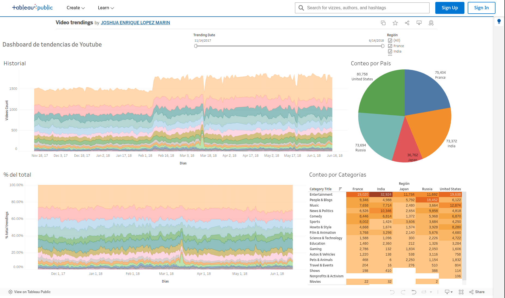

# Tendencias de Videos de YouTube

En esta presentacion encontraras el enlace a un dashboard interactivo creado en Tableau Public para conocer las tendencias historicas de videos de Youtube

### Requisitos Técnicos

* **Objetivo de Negocio**: Analizar las tendencias históricas de videos de YouTube para mejorar la planificación de videos publicitarios.
* **Frecuencia de Uso**: Al menos una vez al día.
* **Usuarios Objetivo**: Gerentes de planificación de videos.
* **Datos Utilizados**: Datos históricos de tendencias de videos categorizados por día, categoría y región.
* **Estructura de los datos (tabla):**

    * `record_id`: Clave primaria.
    * `region`: País/región geográfica.
    * `trending_date`: Fecha y hora.
    * `category_title`: Categoría del video.
    * `videos_count`: Número de videos en la sección de tendencias.

### Diseño del Dashboard:

   * Dashboard interactivo en `Tableau Public` basado en la tabla `trending_by_time.csv`.
   * El dashboard permite filtrar por fecha y región, afectando todas las visualizaciones.
   * Incluye gráficos que muestran:

     * Tendencias históricas en números absolutos.
     * Tendencias históricas en porcentajes.
     * Una tabla que muestra la correspondencia entre categorías y países.
     * Un pie-chart que muestra el conteo por paises

**[Enlace al Dashboard Video Trendings](https://public.tableau.com/app/profile/joshua.enrique.lopez.marin/viz/Videotrendings/Dashboard1)**

### Análisis:

   **¿Qué categorías de video estuvieron en tendencia con mayor frecuencia?**

   **Entertainment, People and Blogs y Comedy** son las 3 categorías que mas visualizaciones obtuvieron consistentemente a lo largo de todo el período analizado las cuales se aprecian claramente en le gráfico del historial y de porcentaje del total.

   **Tendencias Temporales:**

   * Se logra apreciar que la categoria **Gaming** tuvo un corto periodo en el que destacó el número de visualizaciones con un 14%, lo que lo colocó en segundo lugar durante ese período

   **¿Cómo se distribuyeron por regiones?**

   **Visualizaciones por País:**

   * 80,758 (23.75%) - Estados Unidos
   * 75,404 (22.18%) - Francia
   * 73,694 (21.68%) - Rusia
   * 36,762 (10.81%) - Japón
   * 73,372 (21.58%) - India

   **¿Qué categorías fueron particularmente populares en Estados Unidos? ¿Hubo diferencias con respecto a otros lugares?**

   En Estados Unidos, **Entertainment** y **Music** son categorías particularmente populares. Mientras que Entertainment lidera a nivel global, Music tiene una popularidad significativamente mayor en EE.UU. respecto a otros países en especial en las fechas mas recientes del análisis donde se posiciona como #1 en EU. People & Blogs es notablemente más popular en Rusia, y News & Politics tiene mayor presencia en India y Rusia que en EE.UU. Con esto podemos notar que si estamos haciendo una campaña publicitaria, es más facil tener mayor alcance promoviendo anuncios generalmente dentro de los videos de entretenimiento a nivel global. Hay paises más preocupados por su politica interna, como la India donde probablemente no sea tan recomendable hacer marketing dentro del género de **News & Politics**

   **Análisis General:**
   El estudio ofrece una visión integral de cómo varían las tendencias y preferencias de videos por región, resaltando tanto similitudes globales como diferencias locales en el consumo de contenido en plataformas de video.

### Vista previa

